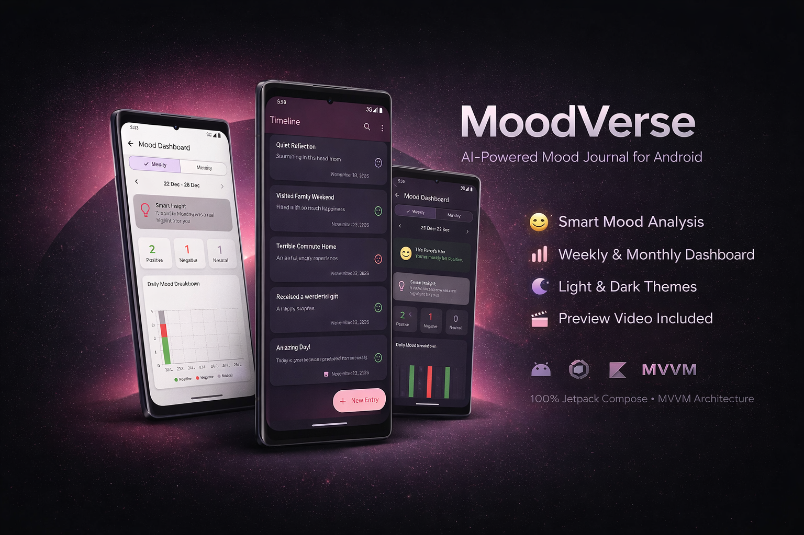
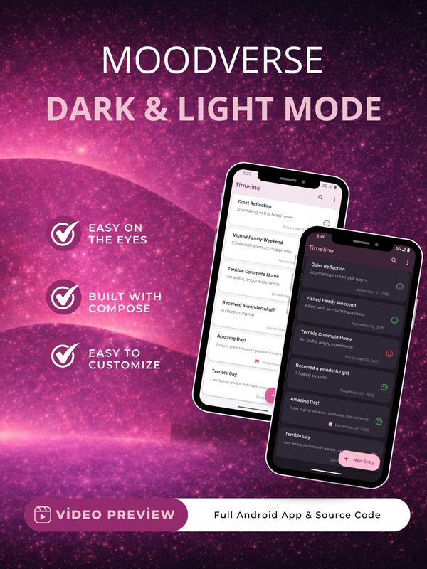
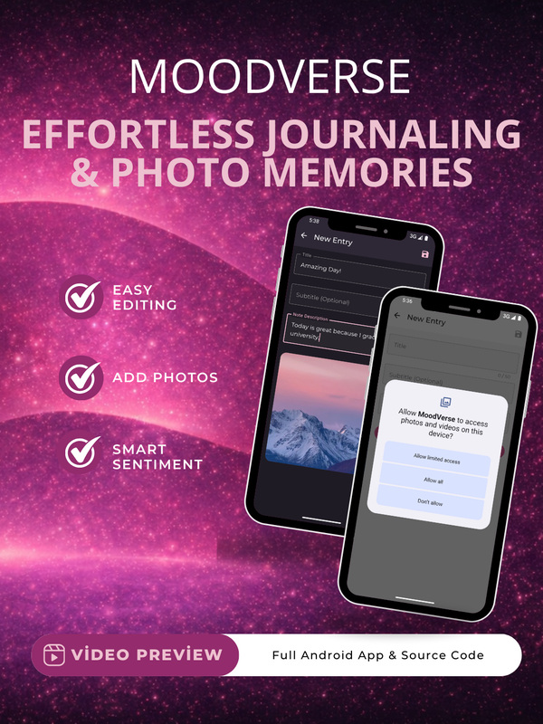
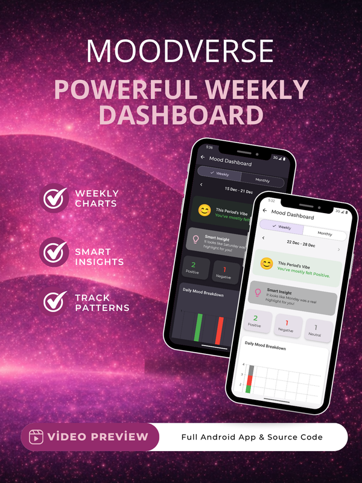
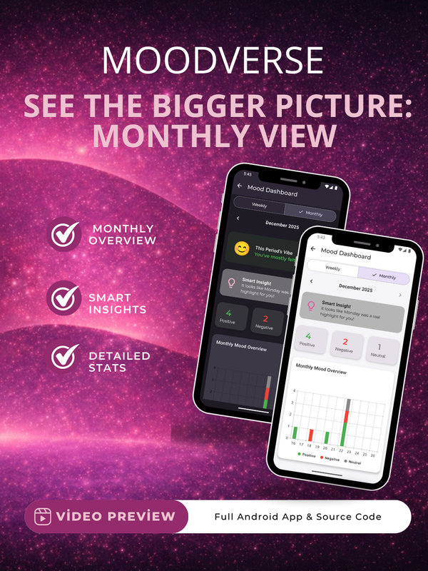
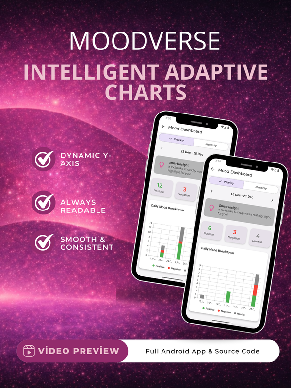
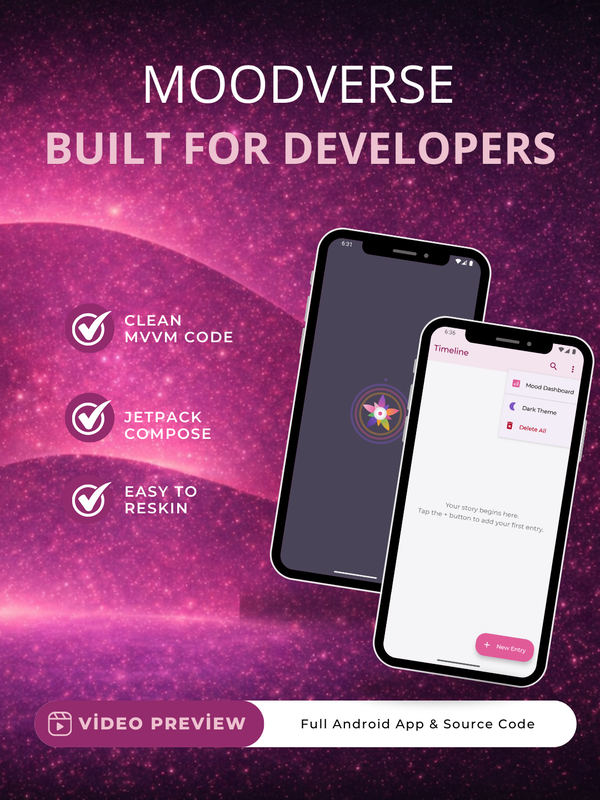

# MoodVerse - Android Architecture & Showcase

MoodVerse is a modern Android application for mood tracking and personal journaling. 

> ⚠️ **Portfolio Showcase Note**
>
> This repository is a **technical portfolio**, not a runnable project. It contains only selected source code files to show the architecture and code quality of the project.

# MoodVerse – AI Mood Journal

  

MoodVerse is an Android mood journal app built with **Kotlin and Jetpack Compose**.

Users can write their daily journal entries and track their mood over time. The app uses **TensorFlow Lite** to analyze journal entries directly on the device.

## Preview

  
  
  

  
  
  

## Main Features

* Daily journal entries
* On-device sentiment analysis with TensorFlow Lite
* Positive, negative, and neutral mood detection
* Mood history and analytics
* Weekly and monthly mood views
* Fully offline support
* Local data storage with Room

## Tech Stack

* **Kotlin**
* **Jetpack Compose**
* **Material 3**
* **MVVM**
* **Room**
* **Hilt**
* **Coroutines & Flow**
* **TensorFlow Lite**

## AI / ML

MoodVerse uses a **TensorFlow Lite** model for sentiment analysis.

The analysis runs directly on the device. Journal data does not need to be sent to a server, and the AI feature can work without an internet connection.

## Architecture

The project follows an **MVVM-based architecture**.

The main goal was to keep the code simple, testable, and easy to extend.

## Links

* [CodeCanyon](https://codecanyon.net/item/moodverse-ai-mood-journal-full-android-app-jetpack-compose/61348983)
